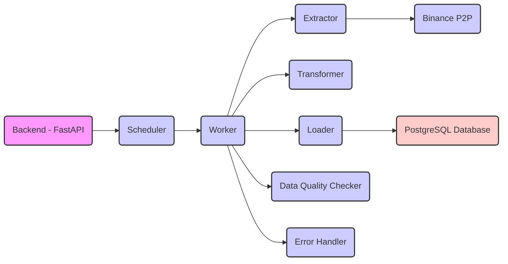
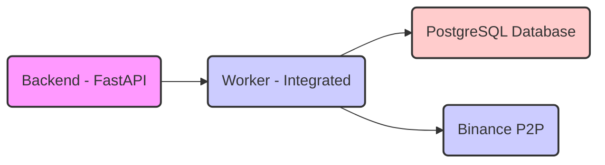

# P2P Data Ingestion Worker - Product Requirements Document

## Executive Summary

This document outlines the architecture, specifications, and implementation requirements for a robust, scalable P2P data ingestion worker that is integrated into the existing backend. The worker will be responsible for extracting comprehensive trading data from Binance P2P markets and loading it into a PostgreSQL database.

## 1. System Architecture Overview

### 1.1 High-Level Architecture

The system consists of the following components:

1.  **Backend (Existing FastAPI):** Provides the API endpoints for accessing P2P data and manages user authentication and authorization.
2.  **Scheduler:** Triggers the worker to run at regular intervals.
3.  **Worker:** Orchestrates the data extraction, transformation, and loading process.
4.  **Extractor:** Extracts data from Binance P2P using the internal scraping logic.
5.  **Transformer:** Transforms the extracted data into a format suitable for loading into PostgreSQL.
6.  **Loader:** Loads the transformed data into the PostgreSQL database.
7.  **Data Quality Checker:** Validates the extracted data and ensures that it meets certain quality standards.
8.  **Error Handler:** Catches and logs any errors that occur during the extraction, transformation, or loading process.
9.  **PostgreSQL Database:** Stores the extracted P2P data, market depth, and operational metrics.

The system consists of three main components:

1.  **Backend (Existing FastAPI):** Provides the API endpoints for accessing P2P data and manages user authentication and authorization.
2.  **Worker (Integrated):** Extracts data from Binance P2P, transforms it, and loads it into the PostgreSQL database.
3.  **PostgreSQL Database:** Stores the extracted P2P data, market depth, and operational metrics.

### 1.2 Data Flow

1.  The worker is triggered by a scheduler within the backend.
2.  The worker extracts data from Binance P2P using the internal scraping logic.
3.  The worker transforms the extracted data into a format suitable for loading into PostgreSQL.
4.  The worker loads the transformed data into the PostgreSQL database.
5.  The backend provides API endpoints for querying the data in the PostgreSQL database.

## 2. Core Requirements

### 2.1 Functional Requirements

*   **Comprehensive Data Extraction:** Extract all available P2P data, including all fiat currencies, crypto assets, trade types (BUY/SELL), and data points per offer (offer ID, advertiser details, pricing information, volume data, payment methods, terms and conditions, order completion time statistics, response time metrics, timestamp of extraction).
*   **Batch Processing Architecture:** Execute complete extraction cycle every 10 minutes, process fiats in parallel, handle rate limiting gracefully, and ensure maximum batch execution time of 8 minutes.
*   **Data Quality & Validation:** Validate data types and ranges, detect and flag anomalies, implement checksums for data integrity, track extraction completeness, and maintain an audit trail of all transformations.
*   **Error Handling & Recovery:** Retry failed requests, log all failures with context, continue batch even if individual fiat extraction fails, implement circuit breaker for external API, and alert on consecutive failures.

### 2.2 Non-Functional Requirements

*   **Performance:** Process 50,000+ offers per 10-minute cycle, database write throughput >1000 records/second, query response time <500ms, and worker utilization 70-85%.
*   **Scalability:** Horizontally scalable worker pool, database partitioning by time, and support for 100+ concurrent fiat extractions.
*   **Reliability:** System uptime 99.5%, data completeness 99.9%, and zero data loss on system failure.
*   **Observability:** Real-time metrics dashboard, detailed logging, distributed tracing for batch workflows, and alerting on SLA violations.

## 3. Database Schema

The PostgreSQL database schema consists of the following tables:

*   **Dimension Tables:**
    *   `dim_cryptocurrencies`: Stores information about cryptocurrencies (crypto_id, symbol, name, binance_asset_code, is_active).
    *   `dim_fiat_currencies`: Stores information about fiat currencies (fiat_id, currency_code, currency_name, country_code, is_active).
    *   `dim_payment_methods`: Stores information about payment methods (payment_method_id, method_code, method_name, category, description, is_active).
    *   `dim_advertisers`: Stores information about advertisers (advertiser_sk, advertiser_id, nickname, is_merchant, registration_days, effective_date, expiration_date, is_current).
*   **Fact Tables:**
    *   `fact_offers`: Stores snapshot of offers (offer_id, offer_external_id, batch_id, extraction_timestamp, crypto_id, fiat_id, advertiser_sk, trade_type, price, available_amount, min_limit, max_limit).
    *   `fact_offer_payment_methods`: Bridge table for offer and payment methods (offer_payment_id, offer_id, extraction_timestamp, payment_method_id, is_primary).
    *   `fact_market_depth`: Stores aggregated market depth snapshots (depth_id, extraction_timestamp, crypto_id, fiat_id, trade_type, total_offers_count, total_available_volume, weighted_avg_price, min_price, max_price).
*   **Operational Tables:**
    *   `ops_batch_runs`: Tracks batch execution (batch_id, batch_start_time, batch_end_time, status, total_fiats_processed, total_offers_extracted, total_offers_inserted, total_offers_updated, total_errors).
    *   `ops_extraction_errors`: Logs extraction errors (error_id, batch_id, error_timestamp, fiat_code, crypto_symbol, trade_type, page_number, error_type, error_message, stack_trace, retry_count, is_resolved).
    *   `ops_data_quality`: Stores data quality metrics (quality_id, batch_id, check_timestamp, metric_name, metric_value, threshold_value, passed, details).

The full SQL code for creating these tables can be found in the database schema document.

## 4. Implementation Plan

The implementation will be divided into the following phases:

*   **Phase 1: Core Infrastructure (Weeks 1-2):**
    *   Implement the database schema in PostgreSQL.
    *   Implement a basic extraction bot with single-threaded execution.
    *   Implement a simple scheduler to trigger the bot.
    *   Implement basic logging infrastructure.
*   **Phase 2: Parallelization & Scale (Weeks 3-4):**
    *   Implement a multi-threaded worker pool for parallel data extraction.
    *   Implement rate limiting to avoid exceeding the Binance P2P API limits.
    *   Implement error recovery mechanisms to handle API errors and network issues.
    *   Populate all dimension tables with initial data.
*   **Phase 3: Quality & Monitoring (Week 5):**
    *   Implement data quality checks to validate the extracted data.
    *   Implement Prometheus metrics to monitor the performance of the worker.
    *   Implement Grafana dashboards to visualize the metrics.
    *   Implement an alert system to notify administrators of any issues.
*   **Phase 4: Optimization & Hardening (Week 6):**
    *   Optimize database queries for performance.
    *   Implement materialized views with a refresh strategy to improve query performance.
    *   Implement a circuit breaker to prevent cascading failures.
    *   Implement a comprehensive testing suite to ensure the quality of the code.

## 5. Key Performance Indicators (KPIs)

The key performance indicators (KPIs) for the P2P data ingestion worker are:

*   **Operational Metrics:**
    *   Uptime: 99.5% system availability
    *   Data Completeness: 99.9% of expected trading pairs captured
    *   Latency: 95th percentile batch completion <480 seconds
    *   Error Rate: <0.5% of extraction attempts fail
*   **Data Quality Metrics:**
    *   Accuracy: 100% of loaded records pass validation
    *   Freshness: Data delay <10 minutes from real-time
    *   Consistency: Zero referential integrity violations
    *   Uniqueness: Zero duplicate offers in the same batch
*   **Business Metrics:**
    *   Coverage: 100% of Binance P2P trading pairs
    *   Historical Depth: 30+ days of continuous data
    *   Query Performance: <500ms for 95% of analytical queries

## 6. Risk Mitigation

The following table outlines potential risks and mitigation strategies for the P2P data ingestion worker:

| Risk | Impact | Probability | Mitigation |
|---|---|---|---|
| Binance API changes | High | Medium | Versioned extractors, automated structure detection, alerts |
| Rate limiting blocks extraction | High | Medium | Adaptive rate limiter, distributed IPs, backoff strategy |
| Database performance degradation | High | Low | Partitioning, indexes, query optimization, monitoring |
| Data loss during failure | Critical | Low | WAL, replication, backup strategy, idempotent operations |
| Memory overflow on large batches | Medium | Medium | Streaming processing, memory limits, chunking |
| Scheduler drift/overlap | Medium | Low | Single instance enforcement, coalescing, SLA monitoring |

## 7. Future Enhancements

The architecture should be designed to accommodate future subworkers for data processing and API/MCP interactions for LLM integration and arbitrage detection.

### Subworkers

To accommodate future subworkers, the worker architecture should be designed in a way that allows for easy addition of new subworkers. This can be achieved by using a modular design and defining clear interfaces between the different components of the worker.

For example, a subworker could be added to perform sentiment analysis on the terms and conditions of the offers. This subworker would receive the terms and conditions from the main worker, perform sentiment analysis, and then return the results to the main worker.

### API/MCP Interactions

To accommodate future API/MCP interactions, the worker architecture should be designed in a way that allows for easy integration with external APIs and the MCP (Message Control Protocol). This can be achieved by using a message queue or a similar mechanism to communicate between the worker and the external APIs/MCP.

For example, the worker could use an API to retrieve additional information about the advertisers, such as their reputation score or their trading history. The worker could also use the MCP to send messages to other components of the system, such as an LLM that is used to detect arbitrage opportunities.